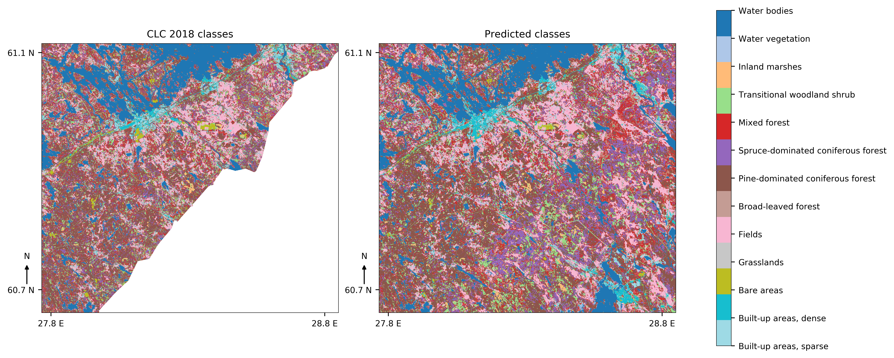

# Land cover classification with deep learning

This repository contains latest version of the codebase related to my master's thesis titled "Land cover classification from multispectral data using convolutional autoencoder networks". Network used here is slightly modified [U-Net](https://lmb.informatik.uni-freiburg.de/people/ronneber/u-net/), trained from scratch. Note that U-Net is nowadays pretty much the de-facto standard for image segmentation.

This version uses Keras with TensorFlow backend. FastAi/PyTorch -versions may arrive later.

## Getting Started

You should have a machine with at least 64GB of RAM, if not more.

### Prerequisites and installing

Anaconda with python 3.6. It's recommended to create virtualenv for this project. Most of the packages are included in Anaconda, and remaining ones are easy to install with conda.

```
conda create -n lulc-ml-env python=3.6 anaconda
conda activate lulc-ml-env
conda install tensorflow keras xarray opencv netcdf4 rasterio holoviews gdal
```

If you have properly configured GPU with enough memory, then replace tensorflow with tensorflow-gpu. If you plan to train new networks, then you must have one. 

Using CSC taito-gpu to train the networks requires different approach. Perhaps the easiest way to is to use python-env/3.5.3-ml -module and install required packages with pip install --user \<package\>. Then just use batch jobs as instructed to train. Note that ml-python packages aren't installed on taito.

### Training data generation

Training and validation data are easy to generate. Just stack CORINE-mosaic and spectral index data (in that order), cast it as float32, extract sufficient number of smaller tiles from it, divide them to be training and validation sets, normalize values and save them as .npy -files. Notebook [Data preprocessing example](preprocessing.ipynb) shows an example of how to do this. 

### Training the networks

Due to images having 14 channels, it's not straightforward to just use imagenet weights.

Pretrained weights are provided here, but if you need to train the model, edit the file [train_model.py](train_model.py) according to your needs and run 

```
python train_model.py
```

Input data is assumed to be .npy -files, but it's simple to modify the script class to work with .tiff, .img or .nc -files. Augmented data from these files is generated during training.

Script saves each model and full training history into specified folder. 

### Classifications

Classifications can be performed with notebook [Land cover classification](lulc.ipynb) or with [make_classifications.py](make_classifications.py) script. Classifications are saved as multiband GeoTIFF file that contains the following bands:

1. Classification raster for the whole area
2. Activation map for Built-up areas, sparse
3. Activation map for Built-up areas, dense
4. Activation map for Bare areas
5. Activation map for Grasslands
6. Activation map for Fields
7. Activation map for Broad-leaved forest
8. Activation map for Pine-dominated coniferous forest
9. Activation map for Spruce-dominated coniferous forest
10. Activation map for Mixed forest
11. Activation map for Transitional woodland shrub
12. Activation map for Inland marshes
13. Activation map for Water vegetation
14. Activation map for Water bodies

Classwise F1-scores compared to CLC2018 labels for Kaakonkulma region vary between over 0.85 (Fields and water bodies) to 0.12 for grasslands. Micro average for F1-scores is 0.7 and macro is 0.58, so there is still much to improve.

Example classifications are from this area:


And results look like this:



### TODO

- Acquire more data for training, either from CORINE mosaics or make GAN to generate it
-

## Authors

* **Janne Mäyrä** - [jaeeolma](https://github.com/jaeeolma)

## License

This project is licensed under the MIT License - see the [LICENSE.md](LICENSE.md) file for details

## Acknowledgments

* unet_builder and unet_blocks are adapted from https://github.com/qubvel/segmentation_models 
* train-time data augmentation are adapted from https://github.com/rogerxujiang/dstl_unet
* DataGenerator classes are adapted from the excellent tutorial by Shervine Amidi: https://stanford.edu/~shervine/blog/keras-how-to-generate-data-on-the-fly