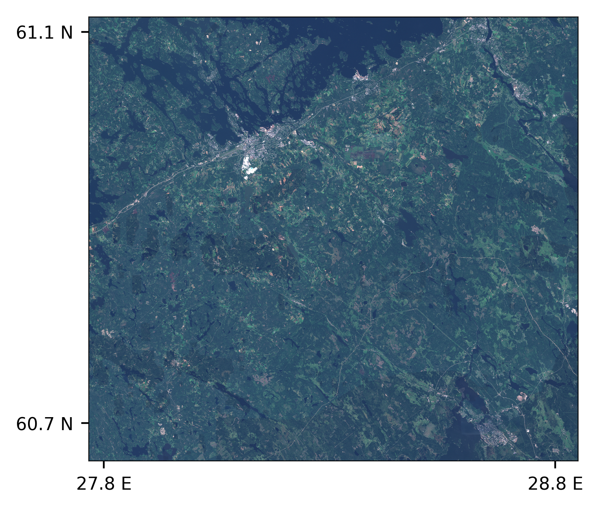

# Land cover classification with U-Net

This repository contains latest version of the codebase related to my master's thesis titled "Land cover classification from multispectral data using convolutional autoencoder networks". Network used here is modified [U-Net](https://lmb.informatik.uni-freiburg.de/people/ronneber/u-net/), trained from scratch. Note that U-Net is nowadays pretty much the de-facto standard for image segmentation, so nothing groundbreaking here.

This version uses Keras with TensorFlow backend. FastAi/PyTorch -version may arrive later.

## Getting Started

You should have a machine with at least 64GB of RAM, if not more. Properly configured GPU doesn't hurt either.

### Prerequisites and installing

Anaconda with python 3.6, due to tensorflow not being available for Python 3.7 yet. It's recommended to create virtualenv for this project. Most of the packages are included in Anaconda, and remaining ones are easy to install with conda.

```
conda create -n lulc-ml-env python=3.6 anaconda
conda activate lulc-ml-env
conda install tensorflow keras xarray opencv netcdf4 rasterio holoviews gdal
```

If you have properly configured GPU with enough memory, then replace tensorflow with tensorflow-gpu. If you plan to train new networks, then you must have one. 

Using CSC taito-gpu to train the networks requires different approach. Perhaps the easiest way to is to use python-env/3.5.3-ml -module and install required packages with pip install --user \<package\>. Then just use batch jobs as instructed to train. Note that ml-python packages aren't installed on taito.

### Training data generation

Training and validation data are easy to generate. Just stack CORINE-mosaic and spectral index data (in that order), cast it as float32, extract sufficient number of smaller tiles from it, divide them to be training and validation sets, normalize values and save them as .npy -files. Notebook [Data preprocessing example](preprocessing.ipynb) shows an example of how to do this. 

These networks are trained with just 8 image stacks sized 850x850px each, so these weights are suited only for Kaakonkulma region and nearby areas. Validation is done with two image stacks. 

### Training the networks

Due to images having 14 channels, it's not straightforward to just use imagenet weights in the encoding path.

Pretrained weights are provided here, but if you need to train the model, edit the file [train_model.py](train_model.py) according to your needs and run 

```
python train_model.py
```

Input data is assumed to be .npy -files, but it's simple to modify the script class to work with .tiff, .img or .nc -files. Augmented data from these files is generated during training.

Script saves each model and full training history into specified folder. 

Three pretrained networks are provided:
- 29-1.09.h5 is the network with lowest validation loss (unweighted categorical crossentropy)
- 74-1.12.h5 has the highest validation accuracy
- 98-1.20.h5 has both the lowest training loss and highest training accuracy. 

Quick tests suggest that 98-1.20.h5 performs best for the whole dataset, but overall differences are very small.

### Classifications

Classifications can be performed with notebook [Land cover classification](lulc.ipynb) or with [make_classifications.py](make_classifications.py) script. Classifications are saved as multiband GeoTIFF file that contains the following bands:

1. Classification raster for the whole area
2. Activation map for Built-up areas, sparse
3. Activation map for Built-up areas, dense
4. Activation map for Bare areas
5. Activation map for Grasslands
6. Activation map for Fields
7. Activation map for Broad-leaved forest
8. Activation map for Pine-dominated coniferous forest
9. Activation map for Spruce-dominated coniferous forest
10. Activation map for Mixed forest
11. Activation map for Transitional woodland shrub
12. Activation map for Inland marshes
13. Activation map for Water vegetation
14. Activation map for Water bodies

Classwise F1-scores compared to CLC2018 labels for Kaakonkulma region vary between more than 0.85 (Fields and water bodies) to 0.12 for grasslands. Micro average for F1-scores is 0.7 and macro is 0.58, so there is still much to improve. Keep in mind though, that CLC2018 labels are not 100% accurate, but rather only 70-80% accurate. This version has not been tested with CLC Level 1 labels, but based on results from master's thesis that level is expected to have overall accuracy of around 92%.

Output has the same geotransform and projection than input file containing spectral indices.

Example classifications are from this area (image from ESA, processed by SYKE):



And results look like this:


Input data is summer 2017 mosaic (9 channels, Sentinel-2 bands B02, B03, B04, B05, B06, B07, B08, B11, B12) stacked with summer 2017 spectral indices  (NDVI, NDTI, NDBI, NDMI, NDSI). 

### TODO

- Acquire more data for training, either from CORINE mosaics or make GAN to generate it
  - More data is required especially for grasslands and other underrepresented classes
- Change loss function to something that takes class imbalance into account and make it work
- When generating the segmentation map the border regions for the sliding windows are not smoothed in any way. Some ideas from [this blog](http://blog.kaggle.com/2017/05/09/dstl-satellite-imagery-competition-3rd-place-winners-interview-vladimir-sergey/) might be useful.
- Figure out some way to use pretrained weights in encoding path.

## Authors

* **Janne Mäyrä** - [jaeeolma](https://github.com/jaeeolma)

## License

This project is licensed under the MIT License - see the [LICENSE.md](LICENSE.md) file for details

## Acknowledgments

* unet_builder and unet_blocks are adapted from https://github.com/qubvel/segmentation_models 
* train-time data augmentation are adapted from https://github.com/rogerxujiang/dstl_unet
* DataGenerator classes are adapted from the excellent tutorial by Shervine Amidi: https://stanford.edu/~shervine/blog/keras-how-to-generate-data-on-the-fly
